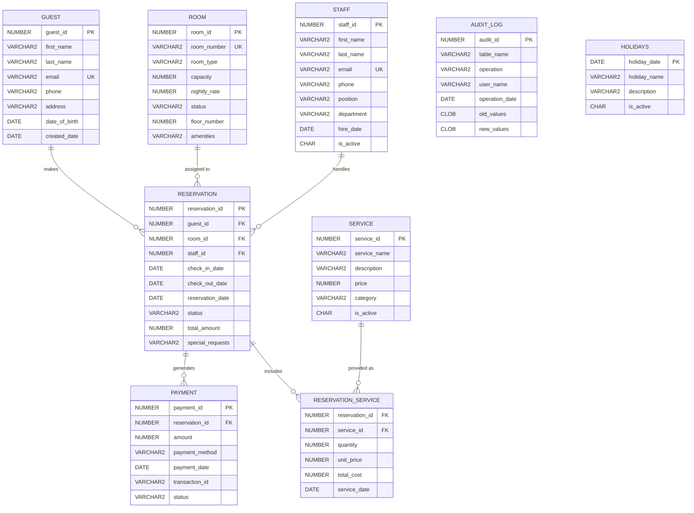

# Smart Hotel Booking Engine - Complete Documentation

**Student:** Sesonga Raphael  
**Student ID:** 28301  
**Project:** Oracle PL/SQL Hotel Management System

## Table of Contents
1. [Project Overview](#project-overview)
2. [System Architecture](#system-architecture)
3. [Technology Stack](#technology-stack)
4. [Installation Guide](#installation-guide)
5. [Database Schema](#database-schema)
6. [API Documentation](#api-documentation)
7. [Frontend Components](#frontend-components)
8. [Business Logic](#business-logic)
9. [Security Features](#security-features)
10. [Testing](#testing)
11. [Deployment](#deployment)
12. [Troubleshooting](#troubleshooting)

## Project Overview

The Smart Hotel Booking Engine is a comprehensive hotel management system that automates guest registration, room allocation, payment processing, and provides real-time analytics. The system eliminates manual reservation logs and prevents double-bookings through database triggers and business rules.

### Key Features
- **Real-time Room Management**: Live room status tracking and availability
- **Automated Reservations**: Complete booking lifecycle management
- **Payment Processing**: Secure payment handling with audit trails
- **Business Intelligence**: Executive dashboards and analytics
- **Role-based Access**: Secure authentication and authorization
- **Audit Compliance**: Complete system audit trail

### Problem Solved
Replaces fragile manual workflows with a single Oracle-backed engine that updates room state, pricing, and guest data in real time, eliminating double-bookings and lost payments.

## System Architecture

```
┌─────────────────┐    ┌─────────────────┐    ┌─────────────────┐
│   React Frontend │    │  Node.js API    │    │  Oracle Database │
│   (Port 5173)   │◄──►│  (Port 3001)    │◄──►│   PL/SQL Engine  │
└─────────────────┘    └─────────────────┘    └─────────────────┘
         │                       │                       │
         ▼                       ▼                       ▼
┌─────────────────┐    ┌─────────────────┐    ┌─────────────────┐
│  UI Components  │    │  Express Routes │    │  Stored Procs   │
│  - Dashboard    │    │  - /api/rooms   │    │  - Reservations │
│  - Analytics    │    │  - /api/revenue │    │  - Payments     │
│  - Operations   │    │  - /api/guests  │    │  - Triggers     │
└─────────────────┘    └─────────────────┘    └─────────────────┘
```

### Data Flow
1. **User Interaction**: React components handle user input
2. **API Communication**: Frontend calls Node.js REST API
3. **Database Operations**: API executes Oracle PL/SQL procedures
4. **Real-time Updates**: Database triggers maintain data integrity
5. **Response Chain**: Data flows back through API to frontend

## Technology Stack

### Frontend
- **React 19.2.3**: Modern UI framework
- **TypeScript**: Type-safe development
- **Tailwind CSS**: Utility-first styling
- **Vite**: Fast build tool and dev server
- **Lucide React**: Icon library
- **Recharts**: Data visualization

### Backend
- **Node.js**: JavaScript runtime
- **Express.js**: Web framework
- **Oracle Database**: Enterprise database
- **OracleDB Driver**: Node.js Oracle connectivity
- **CORS**: Cross-origin resource sharing

### Database
- **Oracle PL/SQL**: Stored procedures and functions
- **Triggers**: Business rule enforcement
- **Sequences**: Auto-incrementing IDs
- **Constraints**: Data integrity

### Development Tools
- **Vite**: Development server
- **PostCSS**: CSS processing
- **Autoprefixer**: CSS vendor prefixes

## Installation Guide

### Prerequisites
- Node.js 18+ installed
- Oracle Database 19c+ or Oracle XE
- Git for version control

### Database Setup
1. **Create Database Schema**:
   ```sql
   -- Run in Oracle SQL*Plus or SQL Developer
   @database/scripts/01_create_database.sql
   @database/scripts/02_create_tables.sql
   @database/scripts/03_insert_data.sql
   @database/scripts/04_procedures.sql
   ```

2. **Configure Environment**:
   ```bash
   # Create server/.env file
   DB_USER=your_oracle_user
   DB_PASSWORD=your_oracle_password
   DB_CONNECT_STRING=localhost:1521/XE
   PORT=3001
   ```

### Backend Setup
```bash
# Navigate to server directory
cd server

# Install dependencies
npm install

# Start development server
npm run dev
```

### Frontend Setup
```bash
# Navigate to project root
cd ..

# Install dependencies
npm install

# Start development server
npm run dev
```

### Quick Start Script
```bash
# Use the provided batch file (Windows)
start-backend.bat

# Or manually start both servers
cd server && npm start &
npm run dev
```

## Database Schema

### Entity Relationship Diagram (ERD)



### Core Tables

#### GUEST Table
```sql
CREATE TABLE GUEST (
    guest_id NUMBER(10) PRIMARY KEY,
    first_name VARCHAR2(50) NOT NULL,
    last_name VARCHAR2(50) NOT NULL,
    email VARCHAR2(100) UNIQUE NOT NULL,
    phone VARCHAR2(20),
    address VARCHAR2(200),
    date_of_birth DATE,
    created_date DATE DEFAULT SYSDATE
);
```

#### ROOM Table
```sql
CREATE TABLE ROOM (
    room_id NUMBER(10) PRIMARY KEY,
    room_number VARCHAR2(10) UNIQUE NOT NULL,
    room_type VARCHAR2(20) NOT NULL,
    capacity NUMBER(2) NOT NULL,
    nightly_rate NUMBER(8,2) NOT NULL,
    status VARCHAR2(20) CHECK (status IN ('AVAILABLE', 'OCCUPIED', 'RESERVED', 'MAINTENANCE')),
    floor_number NUMBER(2),
    amenities VARCHAR2(500)
);
```

#### RESERVATION Table
```sql
CREATE TABLE RESERVATION (
    reservation_id NUMBER(10) PRIMARY KEY,
    guest_id NUMBER(10) REFERENCES GUEST(guest_id),
    room_id NUMBER(10) REFERENCES ROOM(room_id),
    staff_id NUMBER(10) REFERENCES STAFF(staff_id),
    check_in_date DATE NOT NULL,
    check_out_date DATE NOT NULL,
    reservation_date DATE DEFAULT SYSDATE,
    status VARCHAR2(20) CHECK (status IN ('CONFIRMED', 'CHECKED_IN', 'CHECKED_OUT', 'CANCELLED')),
    total_amount NUMBER(10,2),
    special_requests VARCHAR2(500)
);
```

### Business Rules
- **Weekend Operations Only**: Employees cannot INSERT/UPDATE/DELETE on weekdays
- **Holiday Restrictions**: Operations blocked on public holidays
- **Data Validation**: Email format, positive rates, valid date ranges
- **No Double Bookings**: Enforced through triggers and constraints

### Sequences
```sql
CREATE SEQUENCE seq_guest_id START WITH 1001;
CREATE SEQUENCE seq_room_id START WITH 101;
CREATE SEQUENCE seq_reservation_id START WITH 301;
CREATE SEQUENCE seq_payment_id START WITH 501;
```

## API Documentation

### Endpoints

#### Dashboard Metrics
```http
GET /dashboard/metrics
```
**Response:**
```json
{
  "occupancyRate": 85.2,
  "dailyRevenue": 12450.00,
  "arrivalsToday": 8,
  "inHouseGuests": 42
}
```

#### Room Status
```http
GET /rooms/status
```
**Response:**
```json
[
  {
    "roomId": 101,
    "roomNumber": "101",
    "roomType": "STANDARD",
    "status": "OCCUPIED",
    "guestName": "John Smith"
  }
]
```

#### Revenue Data
```http
GET /revenue/daily
```
**Response:**
```json
[
  {
    "date": "10/15",
    "revenue": 8500.00
  }
]
```

#### Create Reservation
```http
POST /reservations
Content-Type: application/json

{
  "guestId": 1001,
  "roomId": 101,
  "checkIn": "2024-10-25",
  "checkOut": "2024-10-27"
}
```

#### Analytics Endpoints
- `GET /analytics/guests` - Guest segmentation data
- `GET /analytics/financial` - Financial metrics
- `GET /analytics/forecast` - Booking forecasts

## Frontend Components

### Component Structure
```
components/
├── Layout.tsx          # Main application layout
├── Login.tsx           # Authentication component
├── Operations.tsx      # Operations dashboard
├── Analytics.tsx       # Analytics dashboards
├── Charts.tsx          # Data visualization
└── UI.tsx             # Reusable UI components
```

### Key Components

#### Layout Component
- **Navigation**: Sidebar with dashboard links
- **Header**: Search, notifications, user profile
- **Theme Toggle**: Dark/light mode switching
- **Responsive Design**: Mobile-friendly layout

#### Dashboard Views
1. **Executive Overview**: KPIs, revenue trends, alerts
2. **Operations Center**: Room status, check-ins/outs
3. **Financial Report**: Revenue analysis, payment metrics
4. **Guest Analytics**: Customer insights, segmentation
5. **Business Intelligence**: Advanced analytics

#### UI Components
- **StatCard**: KPI display with trend indicators
- **Card**: Reusable container component
- **Badge**: Status indicators
- **Charts**: Revenue trends, occupancy forecasts

### State Management
```typescript
// App-level state
const [isAuthenticated, setIsAuthenticated] = useState(false);
const [currentView, setCurrentView] = useState<View>('EXECUTIVE');
const [metrics, setMetrics] = useState({
  occupancyRate: 0,
  dailyRevenue: 0,
  arrivalsToday: 0,
  inHouseGuests: 0
});
```

## Business Logic

### Core Procedures

#### Create Reservation
```sql
PROCEDURE create_reservation(
    p_guest_id IN NUMBER,
    p_room_id IN NUMBER,
    p_check_in IN DATE,
    p_check_out IN DATE,
    p_reservation_id OUT NUMBER
)
```
- Validates room availability
- Creates reservation record
- Updates room status to RESERVED
- Returns new reservation ID

#### Check-in Process
```sql
PROCEDURE check_in_guest(p_reservation_id IN NUMBER)
```
- Updates reservation status to CHECKED_IN
- Changes room status to OCCUPIED
- Commits transaction

#### Check-out Process
```sql
PROCEDURE check_out_guest(
    p_reservation_id IN NUMBER,
    p_payment_method IN VARCHAR2
)
```
- Calculates total cost using `calculate_total_cost` function
- Creates payment record
- Updates reservation to CHECKED_OUT
- Sets room status to AVAILABLE

### Business Rules Engine

#### Weekend Operations Restriction
```sql
FUNCTION is_operation_restricted RETURN BOOLEAN
```
- Blocks operations Monday-Friday (weekdays)
- Checks for public holidays
- Returns TRUE if operations should be blocked

#### Cost Calculation
```sql
FUNCTION calculate_total_cost(p_reservation_id NUMBER) RETURN NUMBER
```
- Calculates room charges: (checkout - checkin) × nightly_rate
- Adds service charges from RESERVATION_SERVICE
- Returns total amount

### Triggers
- **Audit Trail**: Logs all data modifications
- **Business Rule Enforcement**: Validates operations timing
- **Data Integrity**: Prevents invalid state transitions

## Security Features

### Authentication
- **Session Management**: localStorage-based auth tokens
- **Login Protection**: All routes require authentication
- **Logout Functionality**: Clears session data

### Database Security
- **Parameterized Queries**: Prevents SQL injection
- **Connection Pooling**: Secure database connections
- **Error Handling**: Sanitized error messages

### Access Control
- **Role-based Navigation**: Different views for different roles
- **API Endpoint Protection**: Server-side validation
- **Data Validation**: Input sanitization

### Audit Trail
```sql
CREATE TABLE AUDIT_LOG (
    audit_id NUMBER(10) PRIMARY KEY,
    table_name VARCHAR2(50),
    operation VARCHAR2(10),
    user_name VARCHAR2(50),
    timestamp DATE DEFAULT SYSDATE,
    old_values CLOB,
    new_values CLOB
);
```

## Testing

### Database Testing
```sql
-- Run comprehensive tests
@database/scripts/06_comprehensive_test.sql

-- Test specific procedures
@database/scripts/03_test_system.sql
```

### API Testing
```bash
# Test financial endpoints
cd server
node test-financial.js
```

### Frontend Testing
- Component rendering tests
- User interaction tests
- API integration tests

### Test Data
```sql
-- Sample test data insertion
@database/scripts/03_insert_data.sql
```

## Deployment

### Production Environment
1. **Database Setup**:
   - Oracle Database 19c or higher
   - Proper user privileges and tablespaces
   - Backup and recovery procedures

2. **Application Server**:
   - Node.js production environment
   - PM2 for process management
   - Environment variables configuration

3. **Web Server**:
   - Nginx reverse proxy
   - SSL certificate installation
   - Static file serving

### Build Process
```bash
# Build frontend for production
npm run build

# Start production server
cd server
npm start
```

### Environment Configuration
```bash
# Production .env
NODE_ENV=production
DB_USER=pdb_admin
DB_PASSWORD=12345
DB_CONNECT_STRING=localhost:1521/SHBE_db
PORT=3001
```

## Troubleshooting

### Common Issues

#### Database Connection
**Problem**: Cannot connect to Oracle database
**Solution**:
```bash
# Check Oracle listener status
lsnrctl status

# Verify connection string
sqlplus pdb_admin/12345@localhost:1521/SHBE_db
```

#### API Server Issues
**Problem**: Server won't start
**Solution**:
```bash
# Check port availability
netstat -an | findstr :3001

# Verify environment variables
echo $DB_USER $DB_PASSWORD
```

#### Frontend Build Errors
**Problem**: Vite build fails
**Solution**:
```bash
# Clear node_modules and reinstall
rm -rf node_modules package-lock.json
npm install

# Check TypeScript errors
npx tsc --noEmit
```

### Performance Optimization
- **Database Indexing**: Create indexes on frequently queried columns
- **Connection Pooling**: Configure optimal pool size
- **Caching**: Implement Redis for session management
- **CDN**: Use CDN for static assets

### Monitoring
- **Database Performance**: Monitor query execution times
- **API Response Times**: Track endpoint performance
- **Error Logging**: Implement comprehensive logging
- **Health Checks**: Regular system health monitoring

## Support and Maintenance

### Regular Maintenance
- **Database Backup**: Daily automated backups
- **Log Rotation**: Weekly log cleanup
- **Security Updates**: Monthly dependency updates
- **Performance Review**: Quarterly performance analysis

### Contact Information
- **Developer**: Sesonga Raphael
- **Student ID**: 28301
- **Project Repository**: Smart-Hotel-Booking-Engine
- **Documentation**: `/documentation/` folder

---

*This documentation is maintained as part of the Smart Hotel Booking Engine project. Last updated: October 2024*