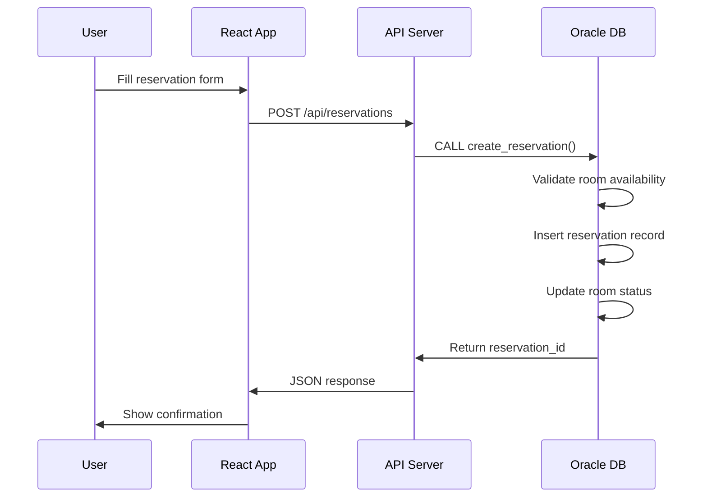

# Smart Hotel Booking Engine - System Architecture

## Architecture Overview

The Smart Hotel Booking Engine follows a three-tier architecture pattern with clear separation of concerns:

```
┌─────────────────────────────────────────────────────────────────┐
│                    PRESENTATION TIER                            │
│  ┌─────────────────┐  ┌─────────────────┐  ┌─────────────────┐ │
│  │   React App     │  │  UI Components  │  │   TypeScript    │ │
│  │   (Frontend)    │  │   - Dashboard   │  │   Type Safety   │ │
│  │                 │  │   - Analytics   │  │                 │ │
│  └─────────────────┘  └─────────────────┘  └─────────────────┘ │
└─────────────────────────────────────────────────────────────────┘
                                │
                                ▼ HTTP/REST API
┌─────────────────────────────────────────────────────────────────┐
│                     APPLICATION TIER                            │
│  ┌─────────────────┐  ┌─────────────────┐  ┌─────────────────┐ │
│  │   Node.js API   │  │  Express Routes │  │  Business Logic │ │
│  │   Server        │  │   - /api/rooms  │  │   Validation    │ │
│  │                 │  │   - /api/guests │  │                 │ │
│  └─────────────────┘  └─────────────────┘  └─────────────────┘ │
└─────────────────────────────────────────────────────────────────┘
                                │
                                ▼ OracleDB Driver
┌─────────────────────────────────────────────────────────────────┐
│                       DATA TIER                                 │
│  ┌─────────────────┐  ┌─────────────────┐  ┌─────────────────┐ │
│  │ Oracle Database │  │   PL/SQL Procs  │  │    Triggers     │ │
│  │   Tables        │  │   Functions     │  │   Constraints   │ │
│  │   Sequences     │  │   Packages      │  │   Audit Logs    │ │
│  └─────────────────┘  └─────────────────┘  └─────────────────┘ │
└─────────────────────────────────────────────────────────────────┘
```

## Component Architecture

### Frontend Architecture (React)

```
src/
├── App.tsx                 # Main application component
├── index.tsx              # Application entry point
├── types.ts               # TypeScript type definitions
├── constants.ts           # Application constants
├── components/
│   ├── Layout.tsx         # Main layout wrapper
│   ├── Login.tsx          # Authentication component
│   ├── Operations.tsx     # Operations dashboard
│   ├── Analytics.tsx      # Analytics dashboards
│   ├── Charts.tsx         # Data visualization
│   └── UI.tsx            # Reusable UI components
└── services/
    ├── apiService.ts      # API communication layer
    └── geminiService.ts   # AI integration service
```

#### Component Hierarchy
```
App
├── Login (if not authenticated)
└── Layout (if authenticated)
    ├── Sidebar Navigation
    ├── Header (search, notifications, user menu)
    └── Main Content Area
        ├── Executive Dashboard
        ├── Operations Dashboard
        ├── Financial Analytics
        ├── Guest Analytics
        └── Business Intelligence
```

### Backend Architecture (Node.js)

```
server/
├── server.js              # Main server file
├── package.json           # Dependencies
├── .env                   # Environment variables
└── test-financial.js      # Testing utilities
```

#### API Layer Structure
```javascript
// Express.js Route Structure
app.use('/api', routes);
├── /dashboard/metrics     # KPI data
├── /rooms/status         # Room availability
├── /revenue/daily        # Financial data
├── /analytics/guests     # Customer insights
├── /analytics/financial  # Revenue metrics
├── /analytics/forecast   # Predictive data
└── /reservations         # Booking operations
```

### Database Architecture (Oracle)

```
database/
├── scripts/
│   ├── 00_deploy_to_shbe.sql      # Deployment script
│   ├── 01_functions_procedures.sql # Core business logic
│   ├── 02_triggers.sql            # Data integrity triggers
│   ├── 03_insert_data.sql         # Sample data
│   ├── 03_test_system.sql         # System tests
│   └── 06_comprehensive_test.sql   # Full test suite
└── documentation/
    └── data_dictionary.md          # Schema documentation
```

#### Database Schema Layers

**Core Business Tables:**
```sql
GUEST ──┐
        ├── RESERVATION ──── PAYMENT
ROOM ───┘        │
                 └── RESERVATION_SERVICE ──── SERVICE
STAFF ───────────┘

AUDIT_LOG (audit trail)
HOLIDAYS (business rules)
```

**Supporting Objects:**
- **Sequences**: Auto-incrementing primary keys
- **Indexes**: Performance optimization
- **Triggers**: Business rule enforcement
- **Functions**: Reusable calculations
- **Procedures**: Complex business operations

## Data Flow Architecture

### Request Flow (Frontend → Backend → Database)

```
1. User Interaction
   ├── React Component Event
   └── State Update

2. API Call
   ├── apiService.ts method
   ├── HTTP Request to Node.js
   └── Express Route Handler

3. Database Operation
   ├── OracleDB Connection
   ├── PL/SQL Procedure Call
   └── Result Processing

4. Response Chain
   ├── Database Result
   ├── API Response
   └── Frontend State Update
```

### Example: Create Reservation Flow



## Security Architecture

### Authentication Layer
```
┌─────────────────┐
│   Frontend      │
│  ┌───────────┐  │    ┌─────────────────┐
│  │ Login     │  │───▶│  localStorage   │
│  │ Component │  │    │  auth_token     │
│  └───────────┘  │    └─────────────────┘
└─────────────────┘
         │
         ▼ HTTP Headers
┌─────────────────┐
│   API Server    │
│  ┌───────────┐  │
│  │ Auth      │  │
│  │ Middleware│  │
│  └───────────┘  │
└─────────────────┘
```

### Database Security
- **Connection Pooling**: Secure connection management
- **Parameterized Queries**: SQL injection prevention
- **User Privileges**: Least privilege principle
- **Audit Logging**: Complete operation tracking

## Performance Architecture

### Frontend Optimization
- **Code Splitting**: Lazy loading of components
- **State Management**: Efficient React state updates
- **Caching**: Browser caching of static assets
- **Bundle Optimization**: Vite build optimization

### Backend Optimization
- **Connection Pooling**: Database connection reuse
- **Async Operations**: Non-blocking I/O
- **Error Handling**: Graceful error recovery
- **Response Compression**: Reduced payload size

### Database Optimization
- **Indexing Strategy**: Optimized query performance
- **Stored Procedures**: Reduced network overhead
- **Triggers**: Real-time data validation
- **Partitioning**: Large table management

## Scalability Architecture

### Horizontal Scaling Options
```
Load Balancer
├── Node.js Instance 1
├── Node.js Instance 2
└── Node.js Instance N
         │
         ▼
Oracle RAC Cluster
├── Database Node 1
├── Database Node 2
└── Database Node N
```

### Vertical Scaling Considerations
- **CPU**: Multi-core processing for Node.js
- **Memory**: Increased heap size for large datasets
- **Storage**: SSD for database performance
- **Network**: High-bandwidth connections

## Integration Architecture

### External System Integration Points
```
Smart Hotel System
├── Payment Gateways (Credit Card Processing)
├── Email Services (Booking Confirmations)
├── SMS Services (Notifications)
├── Property Management Systems
└── Channel Managers (Online Travel Agencies)
```

### API Integration Patterns
- **RESTful APIs**: Standard HTTP methods
- **JSON Data Format**: Lightweight data exchange
- **Error Handling**: Consistent error responses
- **Rate Limiting**: API usage control

## Deployment Architecture

### Development Environment
```
Developer Machine
├── React Dev Server (Port 5173)
├── Node.js API Server (Port 3001)
└── Oracle Database (Local/Docker)
```

### Production Environment
```
Web Server (Nginx)
├── Static Files (React Build)
└── Reverse Proxy
    └── Application Server (Node.js)
        └── Database Server (Oracle)
```

## Monitoring Architecture

### Application Monitoring
- **Health Checks**: Endpoint availability
- **Performance Metrics**: Response times
- **Error Tracking**: Exception monitoring
- **User Analytics**: Usage patterns

### Database Monitoring
- **Query Performance**: Execution plans
- **Connection Monitoring**: Pool utilization
- **Storage Metrics**: Tablespace usage
- **Backup Status**: Data protection

## Future Architecture Considerations

### Microservices Migration
```
Current Monolith → Future Microservices
├── Guest Service
├── Room Service
├── Reservation Service
├── Payment Service
└── Analytics Service
```

### Cloud Architecture
- **Container Deployment**: Docker/Kubernetes
- **Database as a Service**: Oracle Cloud
- **CDN Integration**: Static asset delivery
- **Auto-scaling**: Dynamic resource allocation

---

*This architecture documentation provides a comprehensive view of the Smart Hotel Booking Engine system design and can be used for development, maintenance, and future enhancements.*