# Smart Hotel Booking Engine - BPMN Process Models

**Student:** Sesonga Raphael  
**Student ID:** 28301  
**Project:** Oracle PL/SQL Hotel Management System

## Overview

This document contains Business Process Model and Notation (BPMN) diagrams for the Smart Hotel Booking Engine, illustrating key business processes and workflows.

## Core Business Processes

### 1. Guest Registration and Reservation Process

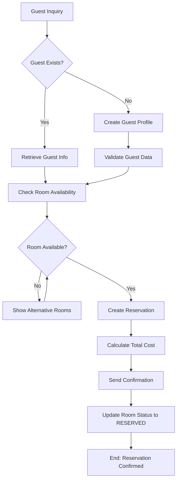

### 2. Check-in Process

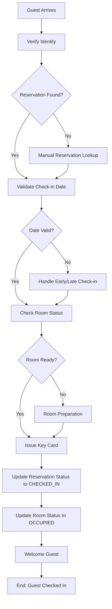

### 3. Service Request Process

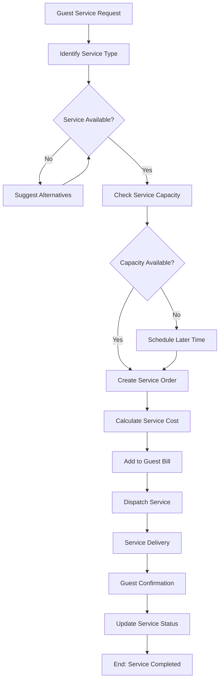

### 4. Payment Processing Workflow

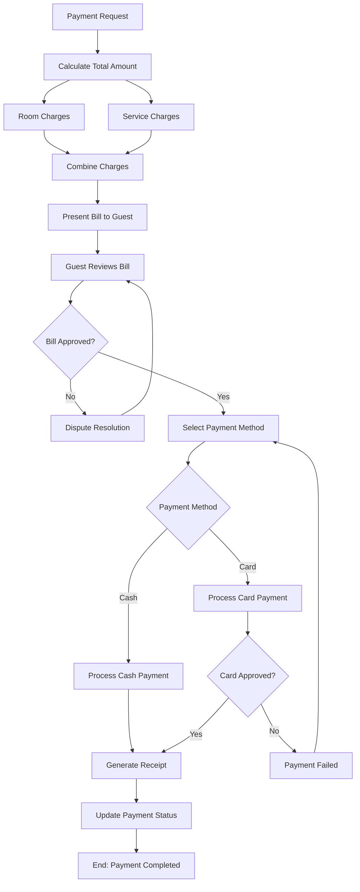

### 5. Check-out Process

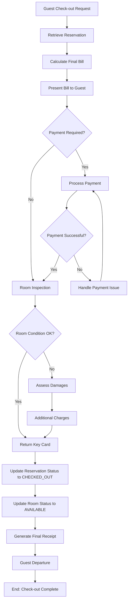

### 6. Room Maintenance Process

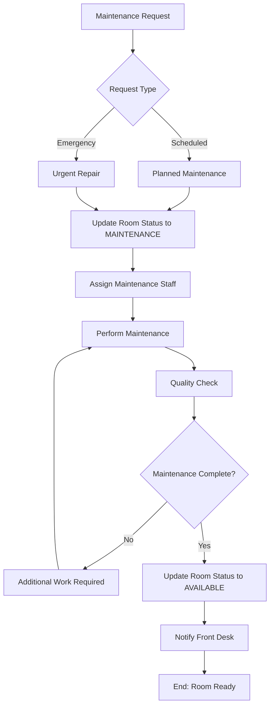

### 7. Cancellation Process

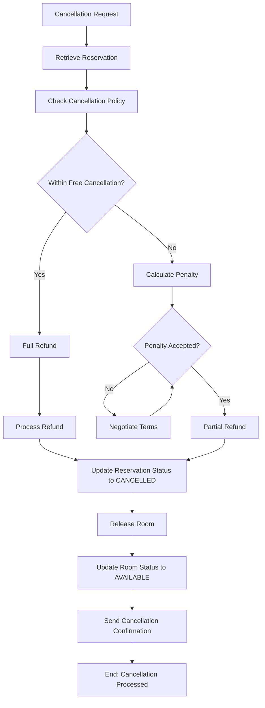

### 8. Business Hours Validation Process

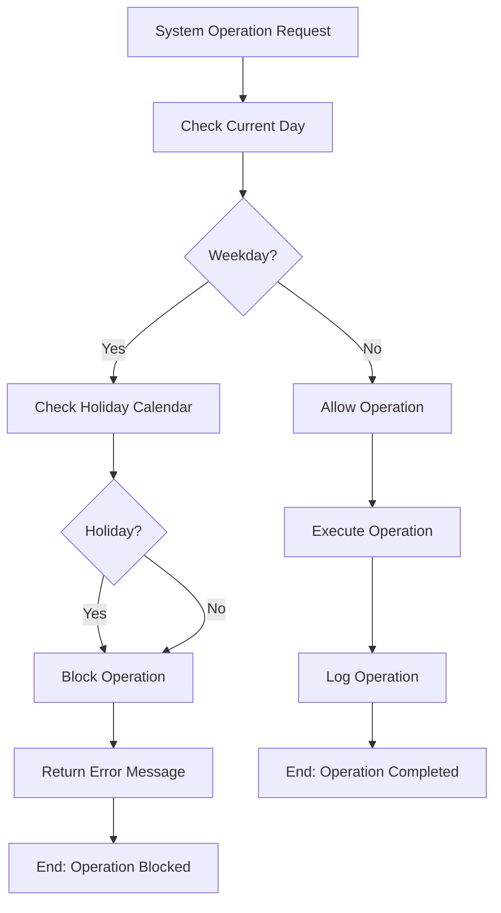

## Swimlane Diagrams

### Guest Check-in Process (Multi-Actor)

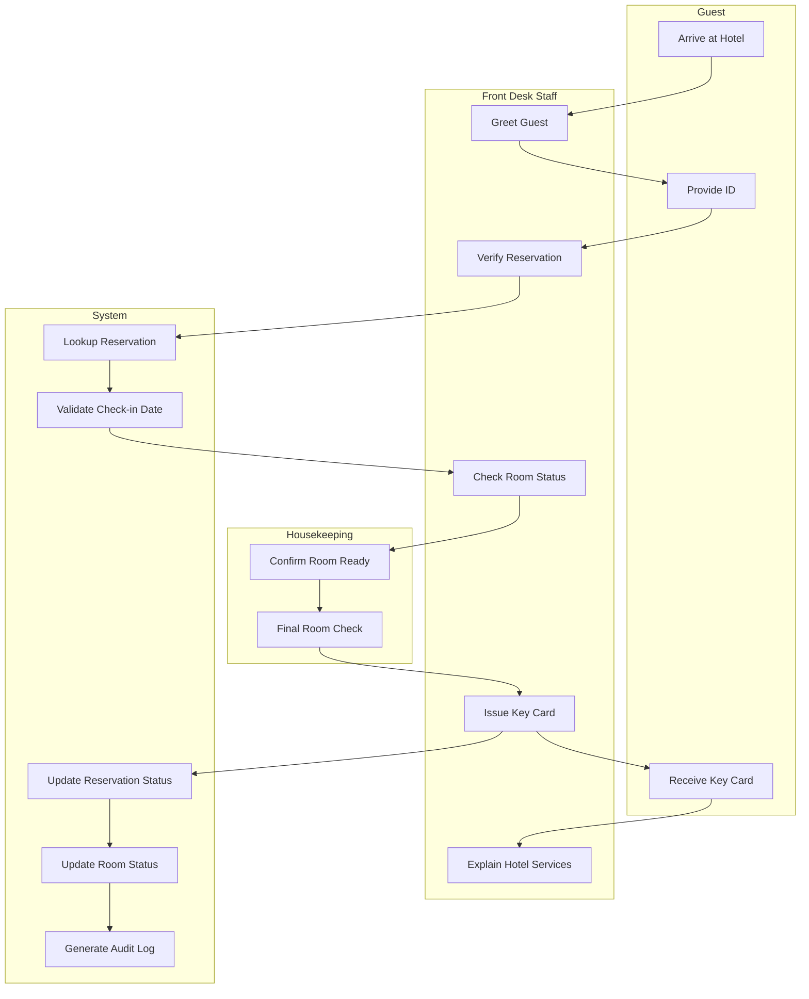

### Payment Processing (Multi-System)

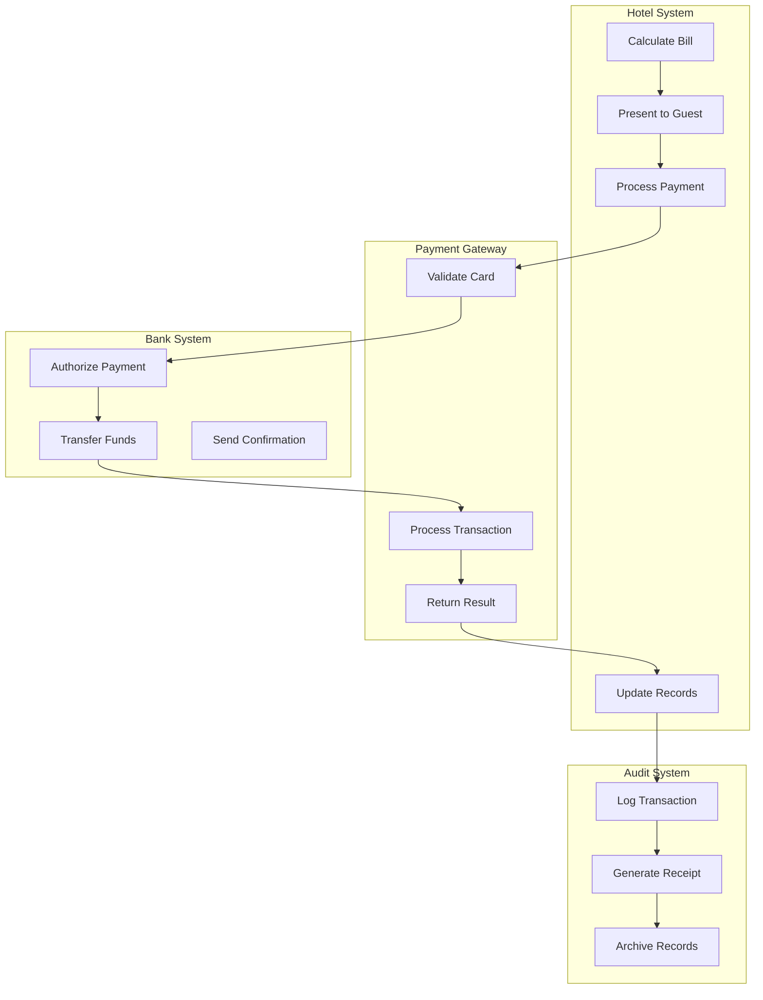

## Exception Handling Processes

### No-Show Handling

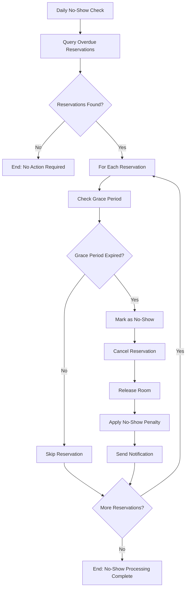

### System Error Recovery

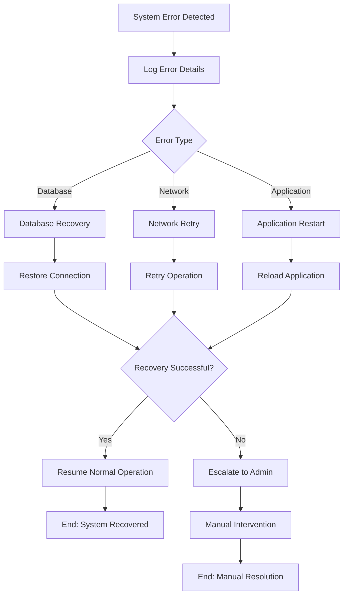

## Compliance and Audit Processes

### Audit Trail Generation

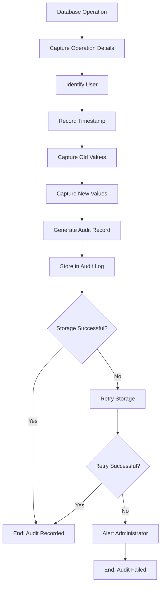

### Data Retention Process

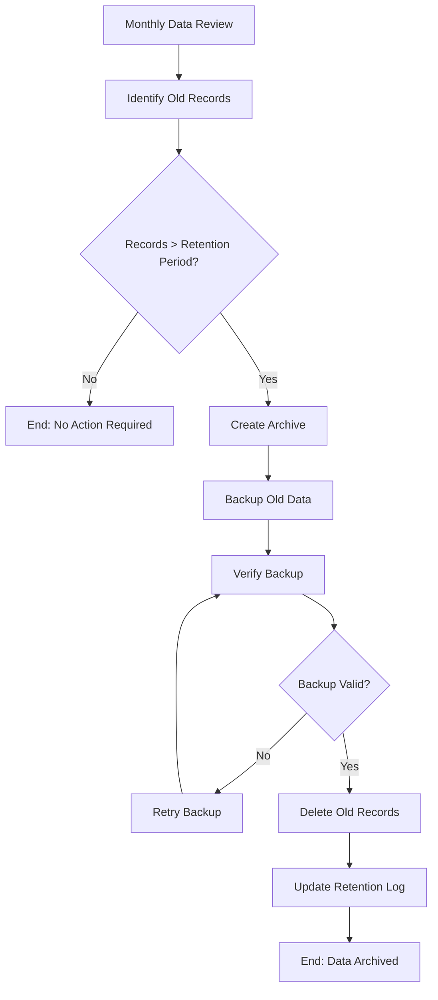

## Performance Monitoring Processes

### System Health Check

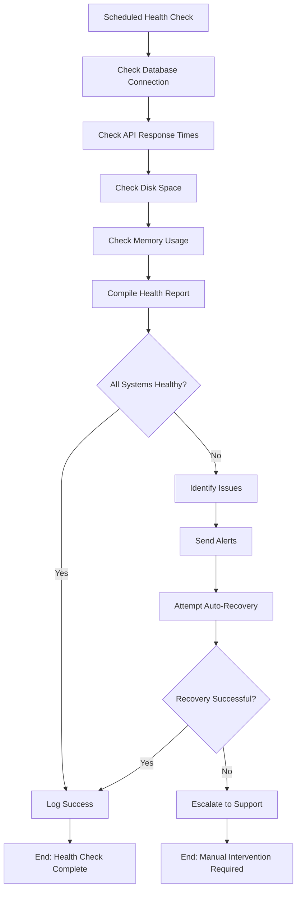

## Integration Points

### External System Integration

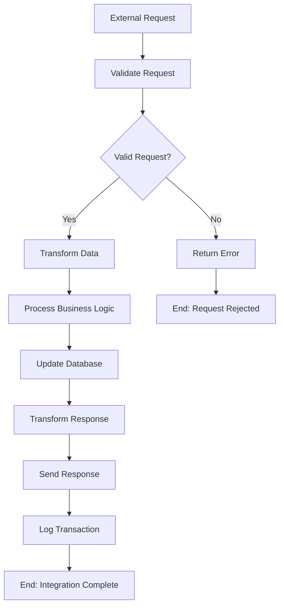

---

*These BPMN diagrams provide a comprehensive view of all business processes in the Smart Hotel Booking Engine, ensuring clear understanding of workflows and decision points.*